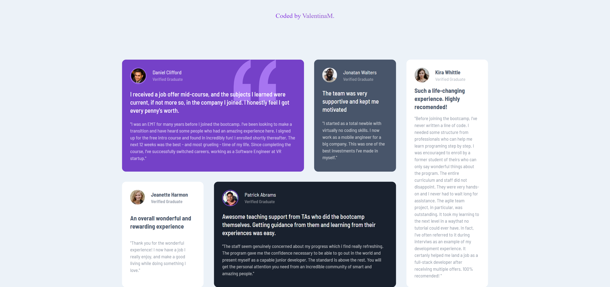

# Testimonials grid section solution

## Table of contents

- [Overview](#overview)
  - [The challenge](#the-challenge)
  - [Screenshots](#screenshots)
  - [Links](#links)
- [My process](#my-process)
  - [Built with](#built-with)
  - [What I learned](#what-i-learned)
  - [Continued development](#continued-development)
  - [Useful resources](#useful-resources)
- [Author](#author)

## Overview

### The challenge

Users should be able to:

- View the optimal layout for the site depending on their device's screen size

### Screenshots

Desktop version:

Mobile version:

### Links

- Production URL: [valentina-milicevic-prod-testimonials-grid.vercel.app](http://valentina-milicevic-prod-testimonials-grid.vercel.app)
- Development URL: [valentina-milicevic-dev-testimonials-grid.vercel.app](http://valentina-milicevic-dev-testimonials-grid.vercel.app)

## My process

### Built with

- Semantic HTML5 markup
- CSS custom properties
- CSS Grid
- Flex box
- Media queries

### What I learned

- I learned that for border-radius sometimes it is more useful to use pixels rather than percentages.
- I learned that for width related tasks it makes sense to use viewport width.
- I had more practice with Grid layout and learned that you can mix grid-template-areas and grid-template-columns.

### Continued development

In future projects I would like to focus on following areas which aren't implemented in testimonials-grid:
- SCSS and Block Element Modifiers for more structured CSS
- Implementing common code using React components 
- Implement project using mobile-first development

### Useful resources

- [MDN - CSS Grid](https://developer.mozilla.org/en-US/docs/Web/CSS/CSS_Grid_Layout) - Was useful as it contains links to all topics neccessary to make Grid layout work.
- [MDN - Ordering flex items](https://developer.mozilla.org/en-US/docs/Web/CSS/CSS_Flexible_Box_Layout/Ordering_Flex_Items) - MDN documentation on how to order items in flex box.
- [YT - CSS Grid Layout Crash Course](https://www.youtube.com/watch?v=jV8B24rSN5o) - Very short and useful introduction to Grid layout.

## Author

- Website - [Valentina Milicevic](https://github.com/vanjamilicevic)
- Email: valentina.milicevic@quantoxtechnology.com
